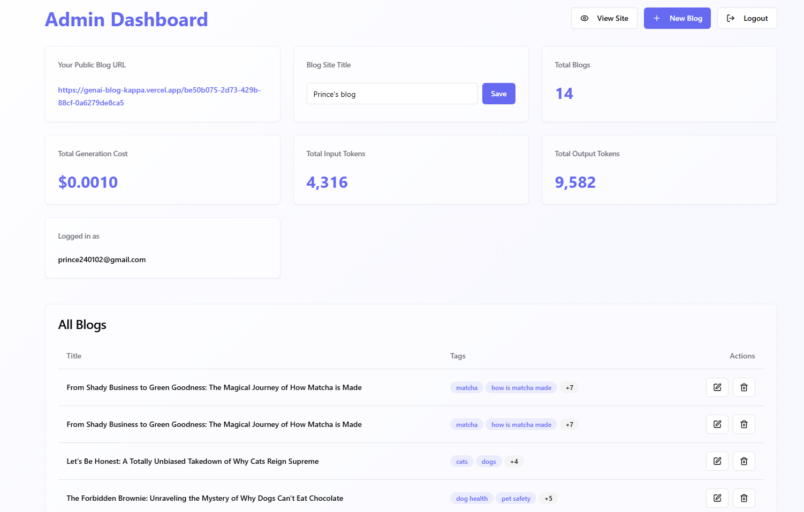
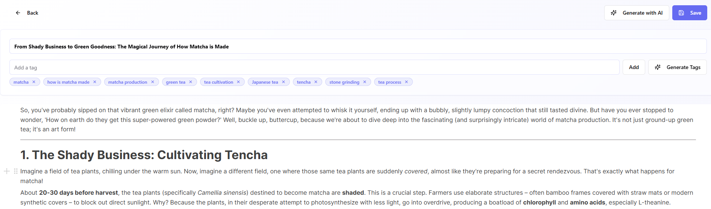
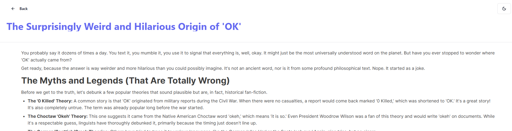

# Markdown Muse: AI-Powered Blog Platform

Markdown Muse is a modern, AI-powered blog platform that allows users to create, manage, and publish their blogs with ease. It features a rich text editor, AI-powered content and tag generation, and a clean, responsive interface.

**Live Demo:** [https://md-muse.vercel.app](https://md-muse.vercel.app)

**Example User Blog:** [https://md-muse.vercel.app/be50b075-2d73-429b-88cf-0a6279de8ca5](https://md-muse.vercel.app/be50b075-2d73-429b-88cf-0a6279de8ca5)

## Features

- **User Authentication**: Secure user authentication using Supabase Auth.
- **Admin Dashboard**: A comprehensive dashboard to manage all your blogs, view stats, and more.
- **Rich Text Editor**: A powerful and intuitive rich text editor powered by BlockNote.
- **AI Content Generation**: Generate blog content from a summary using AI.
- **AI Tag Generation**: Automatically generate relevant tags for your blog posts from the content.
- **Public Blog View**: A clean and beautiful public view for your blog, shareable with a unique URL.
- **Responsive Design**: Fully responsive design that works on all devices.

## Tech Stack

- **Frontend**: React, Vite, TypeScript, Tailwind CSS, shadcn-ui
- **Backend**: Supabase (Auth, Database, Storage, Edge Functions)
- **Editor**: BlockNote

## Getting Started

To get a local copy up and running, follow these simple steps.

### Prerequisites

- Node.js (v18 or higher)
- npm
- A Supabase account

### Installation

1.  **Clone the repo**

    ```sh
    git clone https://github.com/Prince2412k2/genai_blog.git
    cd genai_blog
    ```

2.  **Install NPM packages**

    ```sh
    npm install
    ```

3.  **Set up Supabase**

    -   Create a new project on [Supabase](https://supabase.com/).
    -   Go to your project's settings and copy the `Project URL` and `anon` key.
    -   Create a `.env` file in the root of the project and add the following environment variables:

        ```
        VITE_SUPABASE_URL=YOUR_SUPABASE_PROJECT_URL
        VITE_SUPABASE_ANON_KEY=YOUR_SUPABASE_ANON_KEY
        ```

4.  **Run database migrations**

    -   Install the Supabase CLI: `npm install -g supabase`
    -   Link your local project to your Supabase project: `supabase link --project-ref YOUR_PROJECT_ID`
    -   Push the migrations to your Supabase database: `supabase db push`

5.  **Deploy Supabase functions**

    ```sh
    npx supabase functions deploy
    ```

6.  **Run the development server**

    ```sh
    npm run dev
    ```

    The application will be available at `http://localhost:8080`.

## Screenshots

### Landing Page


### Dashboard


### Blog Editor


### Blog View


### Site Preview


